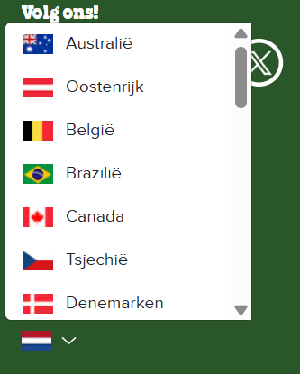
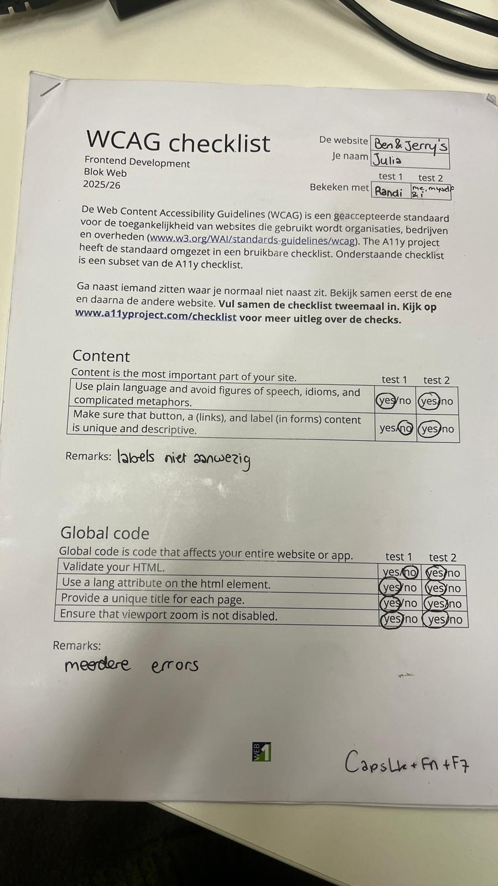
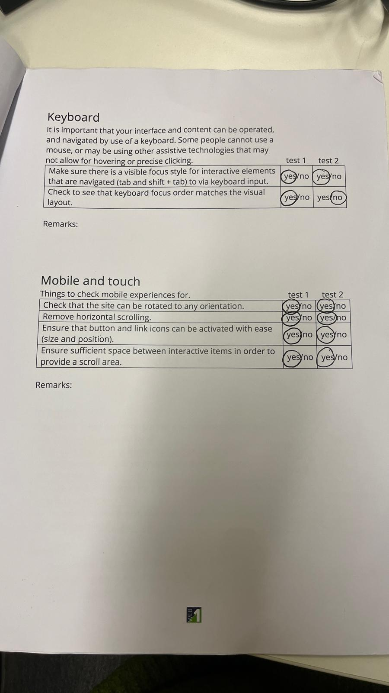
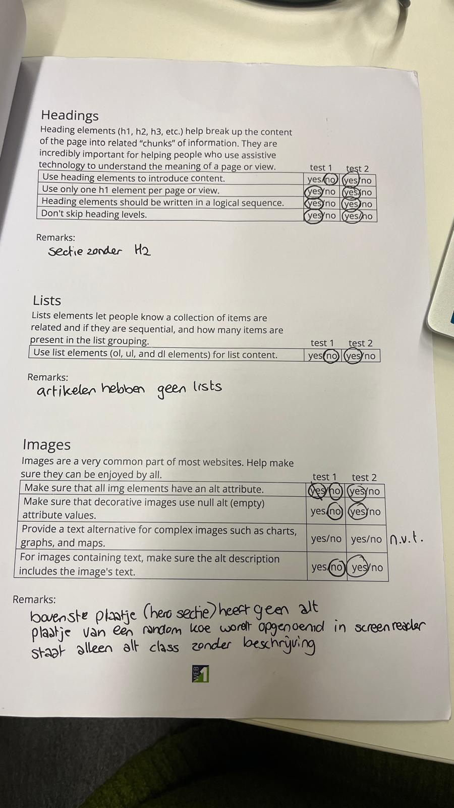
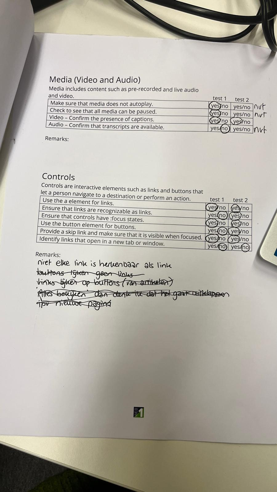
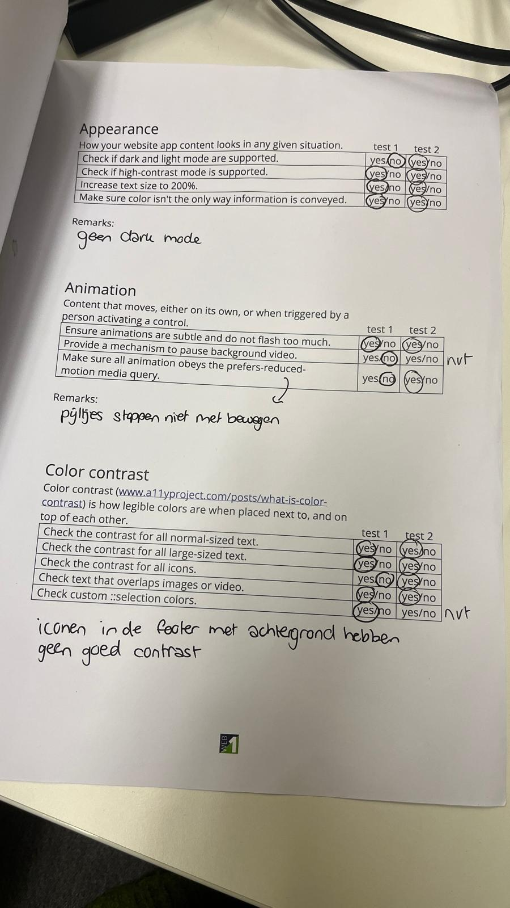

# Procesverslag
Markdown is een simpele manier om HTML te schrijven.  
Markdown cheat cheet: [Hulp bij het schrijven van Markdown](https://github.com/adam-p/markdown-here/wiki/Markdown-Cheatsheet).

Nb. De standaardstructuur en de spartaanse opmaak van de README.md zijn helemaal prima. Het gaat om de inhoud van je procesverslag. Besteedt de tijd voor pracht en praal aan je website.

Nb. Door *open* toe te voegen aan een *details* element kun je deze standaard open zetten. Fijn om dat steeds voor de relevante stuk(ken) te doen.

## Jij

  
uitwerken voor kick-off werkgroep

  ### Auteur:
  Julia van Walderveen

  #### Je startniveau:
  Blauw

  #### Je focus:
  Responsive
 

## Je website

  
uitwerken voor kick-off werkgroep

  ### Je opdracht:
  https://www.benjerry.nl/

  #### Screenshot(s) van de eerste pagina (small screen): 
  hier de naam van de pagina  
  

  #### Screenshot(s) van de tweede pagina (small screen):
  hier de naam van de pagina  
  
 

## Toegankelijkheidstest 1/2 (week 1)

  
uitwerken na test in 2e werkgroep

  ### Bevindingen
  Lijst met je bevindingen die in de test naar voren kwamen:
  Er zitten geen labels in, 
  html validator geeft een hoop errors,
  Er is een sectie zonder H2
  Artikelen bestaan niet uit lists, wat wel beter is
  Bovenste plaatje heeft geen alt tekst, plaatje van een koe wordt ook opgelezen in screenreader, ondanks dat deze niks toevoegt
  Er staat vaak een alt class bij een foto, zonder alt tekst over wat de foto is
  dark mode deed het niet, contrast wel

## Breakdownschets (week 1)

  
uitwerken na afloop 3e werkgroep

  ### de hele pagina: 
  

  ### dynamisch deel (bijv menu): 
  
  ik heb hiervan heel dom geen screenshot gemaakt begin vd periode, de zoekbalk is nieuw en stond er eerder niet, die zit dus ook niet in mijn code

  ### wellicht nog een dynamisch deel (bijv filter): 
  

## Voortgang 1 (week 2)

  
uitwerken voor 1e voortgang

  ### Stand van zaken
  basis, simpele html gaat best goed, lukt zonder te hoeven opzoeken oid. Gaat soepeler dan vorig jaar maar het is wel veel ophalen want lang niet gedaan. Paar kleine dingetjes nog lastig, zoals youtube video, die moet ik soms dan wel opzoeken.

  ### Agenda voor meeting
  samen met je groepje opstellen

  | Joost                     | Melissa          | Noa             | ik                |
  | vormgeving header& footer | checken html     | tekst resposive | youtube filmpje   |
  | gradient op fotos         | als tijd, css    | html checken    | uitwerking footer |
  | responsive caroussel      |                  |                 |                   |
  

  ### Verslag van meeting
  hier na afloop snel de uitkomsten van de meeting vastleggen

  - a om het hele artikel
  - Youtube filmpje later nog fixen
  - html is goed
  - button beter geen onclick
  

## Voortgang 2 (week 3)

  
uitwerken voor 2e voortgang

  ### Stand van zaken
  begonnen met css, so far so good. Wel lastig om weer op te halen maar het gaat prima. 

  ### Agenda voor meeting
  samen met je groepje opstellen

  | Noa             | Melissa        | ik              | Randi            |
  | img 1e sectie.  | caroussel met  | Mag mn span?    | ---              |
  | 3e sectie tekst | 3 plaatjes met | Youtube filmpje | geen specifieke  |
  | scrollend.      | grid           | werkt niet.     | vraag            | 
  | ...             | ...            | ...             | ...              |

  ### Verslag van meeting
  mijn youtube filmpje is gefixt, simpeler dan ik dacht.
  Interessante info over filmpje en autoplay etc. Ook over hovers met de aparte images.
  spans toegestaan, wel arialabel toevoegen voor screenreader, zodat screenreader specifieker opnoemt wat je kan kopen.

## Toegankelijkheidstest 2/2 (week 4)

  
uitwerken na test in 9e werkgroep

  ### Bevindingen
  - labels zijn nu aanwezig
  - mn html validator is goed, heb alleen 1 info, geen errors oid
  - overal waar een header hoort, staat deze nu wel. Elke sectie begin ik nu met een h2, waar deze niet visueel     hoeft zijn deze hidden
  - ik heb list elements waar nodig 
  - all img's die een alt nodig hebben, hebben een alt 
  - img die geen alt nodig hebben, hebben een null alt, zoals de decoratieve koe in de footer
  - ook tekst die in een afbeelding staan, staan in de alt, zoals bij de producten op de pagina smaken
  - links zijn duidelijk links, zowel in light als in dark mode
  - light en dark mode doen het beide
  
Bovenstaande zijn allemaal verbeteringen ten opzichte van wat het eerder was.

  
  
  
  
  

## Voortgang 3 (week 4)

  
uitwerken voor 3e voortgang

  ### Stand van zaken
  header is af, ben nog bezig met het begrijpen van alle code maar de grote lijn is duidelijk, css is op de footer na al best ver

  ### Agenda voor meeting
  samen met je groepje opstellen

  | ik               | Melissa           | Randi          | student 4        |
  | plaatje links    | caroussel         | html goed      | ---              |
  | vd tekst zetten  | button states     | ingesprongen   | en dan ik dat    |
  | lettertype in    | video, hero image | hero sectie    | dit wil ik zeker |
  | select           | add cart          | ...            | ...              |

  ### Verslag van meeting
  studentassistenten hebben me goed geholpen met mijn footer, we hebben het plaatje adhv grid links van de rest vd tekst gekregen en ik ben zelf ondertussen verder gaan puzzelen, voor het eind van de voortgang was deze eigenlijk al bijna helemaal zoals hij moest zijn. Lettertype was ook easy aangepast gelukkig! Ik had net de verkeerde selector

## Eindgesprek (week 5)

  
uitwerken voor eindgesprek

  ### Je uitkomst - karakteristiek screenshots:
  

  ### Dit ging goed/Heb ik geleerd: 
  Het heeft even geduurd, maar hoe slecht ik begin van deze periode het verband kon zien en kon bedenken welke attributen en selectoren ik nodig had, gaat dit nu eigenlijk best soepel. Ik kom er meestal zelf uit zonder op te hoeven zoeken. 
  Het overzicht en debuggen adhv inspecten lukt me ook steeds beter

  

  ### Dit was lastig/Is niet gelukt:
  uitvinden welke css code ik moet gebruiken blijft lastig, met grid, wanneer ik justify-content, align-content etc gebruik. Grid en flex sowieso blijven lastig maar wordt wel steeds logischer, alleen zelf alles uitzoeken duurt lang omdat ik toch veel moet uitproberen totdat ik de juiste code heb.

  

## Bronnenlijst

  
continu bijhouden terwijl je werkt

  Nb. Wees specifiek ('css-tricks' als bron is bijv. niet specifiek genoeg). 
  Nb. ChatGpT en andere AI horen er ook bij.
  Nb. Vermeld de bronnen ook in je code.

  1. (https://www.a11yproject.com/posts/how-to-hide-content)
  2. chatGPT
  3. Sanne & studentassistenten
  4. Randi 
  5. Noa 
  6. Nienke (studentassistent)
  7. w3schools voor reminden hoe ik bepaalde selectoren precies gebruik

