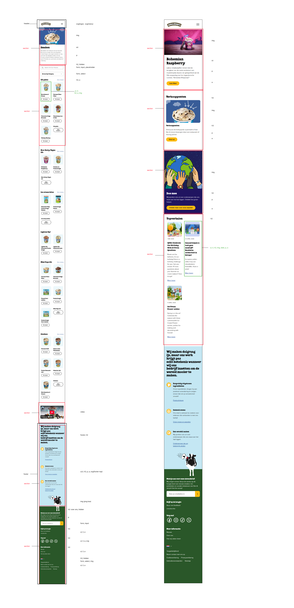

# Procesverslag
Markdown is een simpele manier om HTML te schrijven.  
Markdown cheat cheet: [Hulp bij het schrijven van Markdown](https://github.com/adam-p/markdown-here/wiki/Markdown-Cheatsheet).

Nb. De standaardstructuur en de spartaanse opmaak van de README.md zijn helemaal prima. Het gaat om de inhoud van je procesverslag. Besteedt de tijd voor pracht en praal aan je website.

Nb. Door *open* toe te voegen aan een *details* element kun je deze standaard open zetten. Fijn om dat steeds voor de relevante stuk(ken) te doen.

## Jij

  
uitwerken voor kick-off werkgroep

  ### Auteur:
  Julia van Walderveen

  #### Je startniveau:
  Blauw

  #### Je focus:
  Responsive
 

## Je website

  
uitwerken voor kick-off werkgroep

  ### Je opdracht:
  https://www.benjerry.nl/

  #### Screenshot(s) van de eerste pagina (small screen): 
  hier de naam van de pagina  
  

  #### Screenshot(s) van de tweede pagina (small screen):
  hier de naam van de pagina  
  
 

## Toegankelijkheidstest 1/2 (week 1)

  
uitwerken na test in 2e werkgroep

  ### Bevindingen
  Lijst met je bevindingen die in de test naar voren kwamen:
  Er zitten geen labels in, 
  html validator geeft een hoop errors,
  Er is een sectie zonder H2
  Artikelen bestaan niet uit lists, wat wel beter is
  Bovenste plaatje heeft geen alt tekst, plaatje van een koe wordt ook opgelezen in screenreader, ondanks dat deze niks toevoegt
  Er staat vaak een alt class bij een foto, zonder alt tekst over wat de foto is
  dark mode deed het niet, contrast wel

## Breakdownschets (week 1)

  
uitwerken na afloop 3e werkgroep

  ### de hele pagina: 
  

  ### dynamisch deel (bijv menu): 
  

  ### wellicht nog een dynamisch deel (bijv filter): 
  

## Voortgang 1 (week 2)

  
uitwerken voor 1e voortgang

  ### Stand van zaken
  basis, simpele html gaat best goed, lukt zonder te hoeven opzoeken oid. Gaat soepeler dan vorig jaar maar het is wel veel ophalen want lang niet gedaan. Paar kleine dingetjes nog lastig, zoals youtube video, die moet ik soms dan wel opzoeken.

  ### Agenda voor meeting
  samen met je groepje opstellen

  | Joost                     | Melissa          | Noa             | ik                |
  | vormgeving header& footer | checken html     | tekst resposive | youtube filmpje   |
  | gradient op fotos         | als tijd, css    | html checken    | uitwerking footer |
  | responsive caroussel      |                  |                 |                   |
  

  ### Verslag van meeting
  hier na afloop snel de uitkomsten van de meeting vastleggen

  - a voor het hele artikel
  - Youtube filmpje nog fixen
  - html is goed
  - button beter geen onclick
  

## Voortgang 2 (week 3)

  
uitwerken voor 2e voortgang

  ### Stand van zaken
  begonnen met css, so far so good. Wel lastig om weer op te halen maar het gaat prima

  ### Agenda voor meeting
  samen met je groepje opstellen

  | Noa             | Melissa        | ik              | Randi         |
  | img 1e sectie.  | caroussel met  | Mag mn span?    | ---           |
  | 3e sectie tekst | 3 plaatjes met | Youtube filmpje | en dan ik dat |
  | scrollend.      | grid           | werkt niet.     |               | 
  | ...             | ...            | ...             | ...           |

  ### Verslag van meeting
  mijn youtube filmpje is gefixt, simpeler dan ik dacht.
  Interessante info over filmpje en autoplay etc. Ook over hovers met de aparte images.
  spans toegestaan, wel arialabel toevoegen voor screenreader, zodat screenreader specifieker opnoemt wat je kan kopen.

  - punt 1
  - punt 2
  - nog een punt
- ...

## Toegankelijkheidstest 2/2 (week 4)

  
uitwerken na test in 9e werkgroep

  ### Bevindingen
  Lijst met je bevindingen die in de test naar voren kwamen (geef ook aan wat er verbeterd is):

## Voortgang 3 (week 4)

  
uitwerken voor 3e voortgang

  ### Stand van zaken
  hier dit ging goed & dit was lastig (neem ook screenshots op van delen van je website en code)

  ### Agenda voor meeting
  samen met je groepje opstellen

  | student 1      | student 2          | student 3    | student 4        |
  | ---            | ---                | ---          | ---              |
  | dit bespreken  | en dit             | en ik dit    | en dan ik dat    |
  | en dat ook nog | dit als er tijd is | nog een punt | dit wil ik zeker |
  | ...            | ...                | ...          | ...              |

  ### Verslag van meeting
  hier na afloop snel de uitkomsten van de meeting vastleggen

  - punt 1
  - punt 2
  - nog een punt
  - ...

## Eindgesprek (week 5)

  
uitwerken voor eindgesprek

  ### Je uitkomst - karakteristiek screenshots:
  

  ### Dit ging goed/Heb ik geleerd: 
  Korte omschrijving met plaatjes

  

  ### Dit was lastig/Is niet gelukt:
  Korte omschrijving met plaatjes

  

## Bronnenlijst

  
continu bijhouden terwijl je werkt

  Nb. Wees specifiek ('css-tricks' als bron is bijv. niet specifiek genoeg). 
  Nb. ChatGpT en andere AI horen er ook bij.
  Nb. Vermeld de bronnen ook in je code.

  1. bron 1
  2. bron 2
  3. ...

